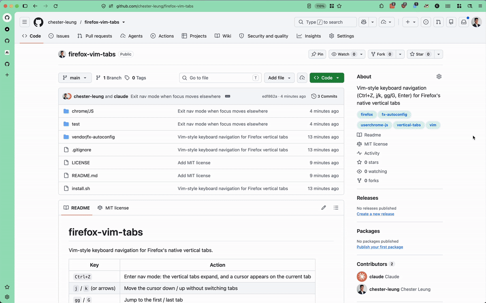

# firefox-vim-tabs

Vim-style keyboard navigation for Firefox's native vertical tabs.



| Key | Action |
| --- | --- |
| `Cmd+E` | Enter nav mode: the vertical tabs expand, and a cursor appears on the current tab |
| `j` / `k` (or arrows) | Move the cursor down / up without switching tabs |
| `gg` / `G` | Jump to the first / last tab |
| `dd` | Close the tab under the cursor (stays in nav mode; cursor moves to the tab below) |
| `Enter` | Switch to the tab under the cursor and exit |
| `Esc` / `Cmd+E` | Exit without switching |

Clicking anywhere, switching windows, or switching tabs some other way (such as Cmd+T) also exits nav mode.
Pinned tabs come first, in the same order as the sidebar. Tabs inside collapsed groups are skipped.

`Cmd+E` replaces Firefox's built-in "use selection for find" shortcut on macOS, which uses the same keys.

## How it works

`chrome/JS/vim-tabs.uc.js` is a privileged browser script loaded by
[fx-autoconfig](https://github.com/MrOtherGuy/fx-autoconfig) (vendored in
`vendor/`, pinned in `vendor/fx-autoconfig/VERSION`). It drives the real tab
strip through Firefox internals (`gBrowser`, `SidebarController`), which
WebExtensions can't reach.

## Install

```sh
./install.sh            # all profiles in profiles.ini
./install.sh <profile>  # or specific profile directories
```

Then restart Firefox. If Firefox was running during install, use
about:support -> "Clear startup cache..." to restart and load it.

macOS blocks writes into `/Applications/Firefox.app` unless your terminal has
**System Settings -> Privacy & Security -> App Management** permission.

**Re-run `./install.sh` after every Firefox update.** Updates replace
Firefox.app and remove the loader's `config.js` and `defaults/pref/config-prefs.js`.
The profile side survives, and the script is symlinked, so edits here apply on
the next restart.

## Test

Runs against a throwaway profile with real key events (nsITextInputProcessor):

```sh
./install.sh /path/to/test-profile   # with user.js: sidebar.revamp + sidebar.verticalTabs = true, marionette.port = 2830
firefox --headless --marionette -remote-allow-system-access -no-remote -profile /path/to/test-profile &
python3 test/e2e.py 2830 shot.png
```

## Uninstall

Delete `config.js` and `defaults/pref/config-prefs.js` from
`/Applications/Firefox.app/Contents/Resources/`, and delete
`chrome/utils` and `chrome/JS/vim-tabs.uc.js` from each profile.

## License

MIT, except `vendor/fx-autoconfig/`, which is MPL-2.0 (see its `LICENSE`).
